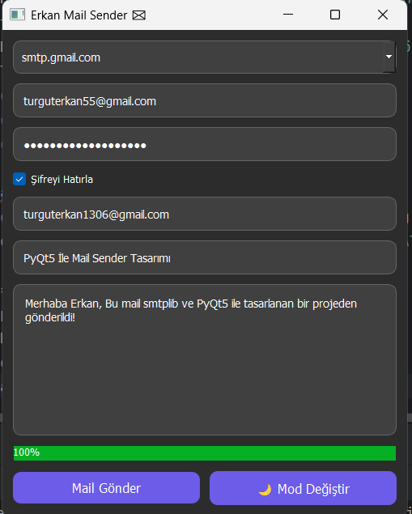

# PyQt5 ve Smtplib ile Mail Sender

Bu proje, PyQt5 kullanılarak geliştirilmiş modern bir e-posta gönderim uygulamasıdır. Kullanıcı dostu bir arayüze ve birçok özelliğe sahiptir.
İstenilen miktarda eş zamanlı olaak birden fazla e-posta gönderme yetenegi bulunmaktadır. Gönderilen e-postalar `logs.txt` dosyasına kaydedilir.
## Özellikler

- SMTP Sunucusu seçimi
- Yükleniyor animasyonu
- Gönderilen maillerin `logs.txt` dosyasına kaydı
- Dark/Light tema modu
- Birden fazla alıcıya mail gönderimi
- Temiz, modern ve mobil uyumlu arayü

## Gereksinimler

- Python 3.x
- PyQt5

Kurulum için:
```bash
pip install pyqt5
```

## Kullanım

1. Uygulamaya başlarken `config.cfg` dosyasında gönderen mail adresinizi ve sifrenizi (base64 encode edilmiş) belirtin.

2. Uygulamayı çalıştırın:
```bash
python mail_sender.py
```

3. Gerekli alanları doldurun:
   - Gönderen E-Posta
   - Şifre
   - Alıcı(lar)
   - Konu
   - Mesaj

4. `Mail Gönder` butonuna tıklayarak mailinizi gönderin.

## Notlar

- Gmail kullanıyorsanız, uygulama şifresi kullanmanız şarttır.
- Base64 ile şifrelenmiş bilgiler tam güvenlik sağlamaz, gelişime açıktır.

## Ekran Görütüleri

> 
> 

## Katkı

Pull request ve önerilere açığız. Şu adımlarla katkı sağlayabilirsin:

- Fork'la
- Branch oluştur (`feature/ozellik`)
- Değişiklik yap ve commitle
- Pull request gönder


---

> Yapım: **Erkan Turgut -** <https://github.com/Erkan3034>